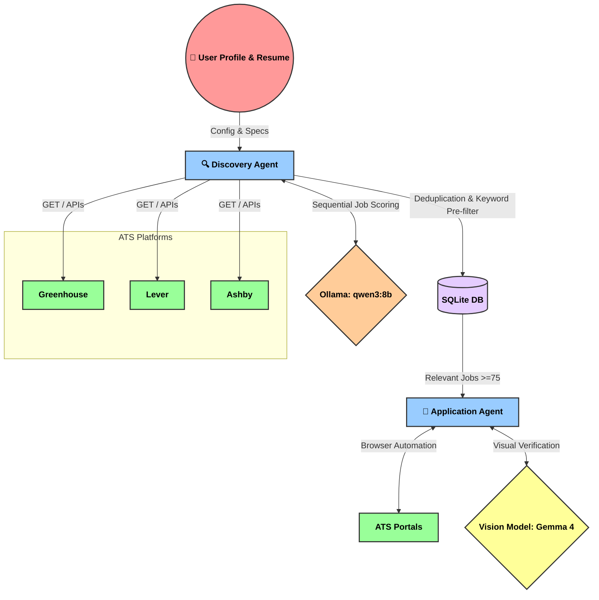

# 🚀 Autonomous AI Career Agent

  
  
  

## 🌟 Project Vision
A production-quality **Autonomous AI Career Agent** designed to automate the entire job application lifecycle. It autonomously discovers jobs from multiple ATS platforms, reasons about candidate fit using local LLMs, and manages applications intelligently. 

Unlike simple browser bots, this is a modular AI system built for scale, maintainability, and extensibility.

---

## 🏗️ Architecture

---

## 🗺️ Phases & Roadmap

### ✅ Phase 1: Intelligent Discovery
**Goal:** Continuously discover and accurately score job postings based on candidate profile fit.
- **Multi-Source Fetching:** Deep integration with Greenhouse (15+ companies), Lever, and Ashby (25+ companies).
- **Keyword Pre-filtering:** Fast keyword evaluation and hard blocklists to instantly discard non-engineering (HR, Legal, Sales, Data Center) roles before burning LLM cycles.
- **LLM Reasoning Loop:** Integrated `qwen3:8b` via local Ollama for nuanced, sequential scoring of jobs across 5 dimensions (Title, Skills, Experience, Location, Overall).
- **Prompt Engineering:** Refined scoring prompts with strict penalties to ensure only highly technical engineering/ML roles pass the threshold.
- **Database Integration:** Scalable SQLite backend tracking thousands of jobs, eliminating duplicate processing.

### 🚧 Phase 2: Autonomous Execution (In Progress)
**Goal:** Automate the application submission process.
- **Browser Automation:** Headed agents that navigate ATS portals and render JS-heavy pages.
- **Form Filling & Q&A:** Dynamic extraction of form fields and LLM-driven answering of application questions based on the candidate's profile.
- **Visual Verification:** Leveraging local vision models (`mlx-community/gemma-4-12b-it-4bit`) to visually verify form submissions, read captchas, and detect success/error states.
- **Document Management:** Automatic uploading of the candidate's resume and dynamically generated, highly-targeted cover letters.

---

## 🏆 What We've Achieved So Far

- 🚀 **Massive Job Ingestion:** Successfully fetched **5,900+ jobs** from top-tier AI and tech companies (Anthropic, ScaleAI, OpenAI, Databricks, Cloudflare, etc.).
- 🧠 **Smart Deduplication & Filtering:** The system automatically skips duplicates and uses keyword analysis to filter out obviously irrelevant titles, reducing LLM load.
- 🎯 **Precision Scoring:** Re-architected the LLM context limits and scoring prompts to accurately evaluate jobs, successfully identifying real gems (like *Applied AI Engineer*, *Machine Learning Engineer*) while punishing noisy generic roles.
- 🔒 **100% Local AI Infrastructure:** Completely reliant on local, private models (Ollama and MLX) ensuring zero API costs and total data privacy.

 

  <i>Built with ❤️ for fully autonomous career advancement.</i>

